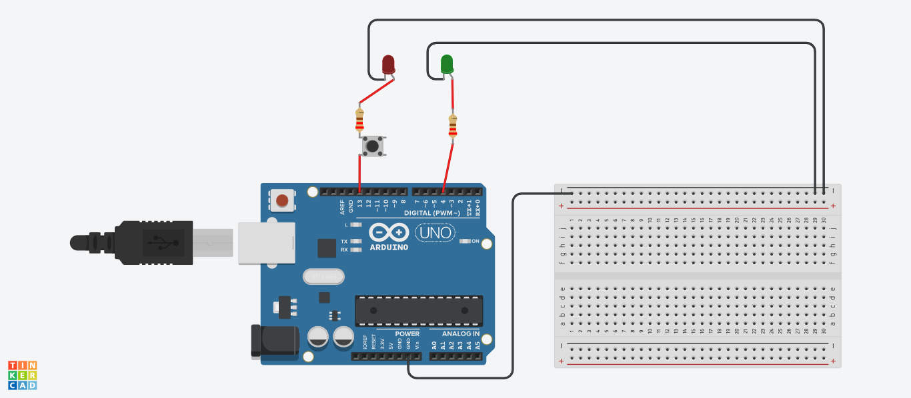

# Curso-Extensao-IoT-Iniciante-Henrique-Poyatos
Repositório para guardar os códigos das aulas do curso de extensão "IoT e edge computing para iniciantes na prática com microbit e Arduino" com o professor Henrique Poyatos.

## 1) Projeto 1: LED Pisca Pisca

<a href="2022-09-03-aula-03/2022-09-03-IoT-com-poyatos-aula-03.ino">Código para o Arduino</a>
<a href="2022-09-03-aula-03/2022-09-03-IoT-com-poyatos-aula-03.brd">Arquivo para o Tinkercad</a>
